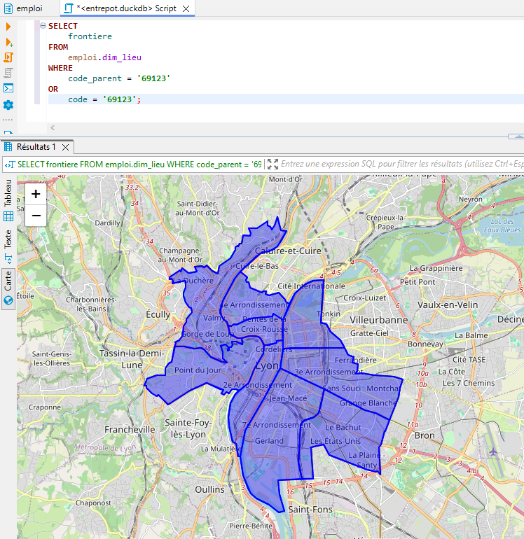

# Requêtage de l'entrepôt DuckDB

Fichier de persistence DuckDB: **./stockage/entrepot-emploi.duckdb**

Les accès à l'entrepôt sont réalisés de deux manières:

- Via l'API Python: [Documentation API Python DuckDB](https://duckdb.org/docs/api/python/overview): utilisé dans les scripts Python
- Via une interface CLI pour les tests/développement: [Documentation CLI DuckDB](https://duckdb.org/docs/api/cli/overview) / [Installation DuckDB](https://duckdb.org/docs/installation/?version=stable&environment=cli&platform=win&download_method=package_manager)
- Via l'IDE SQL DBeaver: [Paramètrage pour DuckDB](https://duckdb.org/docs/guides/sql_editors/dbeaver.html) / [Téléchargement DBeaver](https://dbeaver.io/download/)

## Guide de démarrage rapide avec la CLI

- Liens de téléchargement:

  - DuckDB CLI Windows: <https://github.com/duckdb/duckdb/releases/download/v1.0.0/duckdb_cli-windows-amd64.zip>
  - DuckDB CLI macOS: <https://github.com/duckdb/duckdb/releases/download/v1.0.0/duckdb_cli-osx-universal.zip>
  - DuckDB CLI Linux: <https://github.com/duckdb/duckdb/releases/download/v1.0.0/duckdb_cli-linux-amd64.zip>

- Execution sur une machine Windows:

  - Décompacter le zip à la racine du projet et se positionner sur cet emplacement dans une fenêtre de terminal
  - Lancer la CLI en indiquant le chemin vers le fichier de persistence DuckDB

```powershell
.\duckdb.exe ..\stockage\entrepot-emploi.duckdb
v1.0.0 1f98600c2c
Enter ".help" for usage hints.

D SELECT database_name, path FROM duckdb_databases();
┌───────────────┬─────────────────────────────┐
│ database_name │            path             │
│    varchar    │           varchar           │
├───────────────┼─────────────────────────────┤
│ entrepot      │ ..\stockage\entrepot.duckdb │
│ system        │                             │
│ temp          │                             │
└───────────────┴─────────────────────────────┘

D SELECT schema_name,table_name,column_count FROM duckdb_tables();
┌─────────────┬────────────────────────────────────┬──────────────┐
│ schema_name │             table_name             │ column_count │
│   varchar   │              varchar               │    int64     │
├─────────────┼────────────────────────────────────┼──────────────┤
│ collecte    │ cog_carto_arrondissement_municipal │            6 │
│ collecte    │ cog_carto_commune                  │            8 │
│ collecte    │ cog_carto_departement              │            5 │
│ collecte    │ cog_carto_region                   │            4 │
│ collecte    │ etablissement                      │           54 │
│ collecte    │ naf                                │           10 │
│ collecte    │ naf_hierarchie                     │            5 │
│ collecte    │ naf_niveau_1                       │            2 │
│ collecte    │ naf_niveau_2                       │            2 │
│ collecte    │ naf_niveau_3                       │            2 │
│ collecte    │ naf_niveau_4                       │            2 │
│ collecte    │ naf_niveau_5                       │            2 │
│ collecte    │ raw_offre                          │           16 │
│ collecte    │ rome                               │            6 │
│ collecte    │ rome_domaine                       │            2 │
│ collecte    │ rome_famille                       │            2 │
│ collecte    │ rome_metier                        │            2 │
├─────────────┴────────────────────────────────────┴──────────────┤
│ 17 rows                                               3 columns │
└─────────────────────────────────────────────────────────────────┘

D SELECT database_name, schema_name FROM duckdb_schemas(); 
┌───────────────┬────────────────────┐
│ database_name │    schema_name     │
│    varchar    │      varchar       │
├───────────────┼────────────────────┤
│ entrepot      │ collecte           │
│ entrepot      │ entrepot           │
│ entrepot      │ information_schema │
│ entrepot      │ main               │
│ entrepot      │ pg_catalog         │
│ system        │ information_schema │
│ system        │ main               │
│ system        │ pg_catalog         │
│ temp          │ information_schema │
│ temp          │ main               │
│ temp          │ pg_catalog         │
├───────────────┴────────────────────┤
│ 11 rows                  2 columns │
```

## DBeaver

- [Téléchargement DBeaver](https://dbeaver.io/download/)

- [Paramètrage pour DuckDB](https://duckdb.org/docs/guides/sql_editors/dbeaver.html) 


- DBeaver permet de visualiser les données spatiales



```sql

```