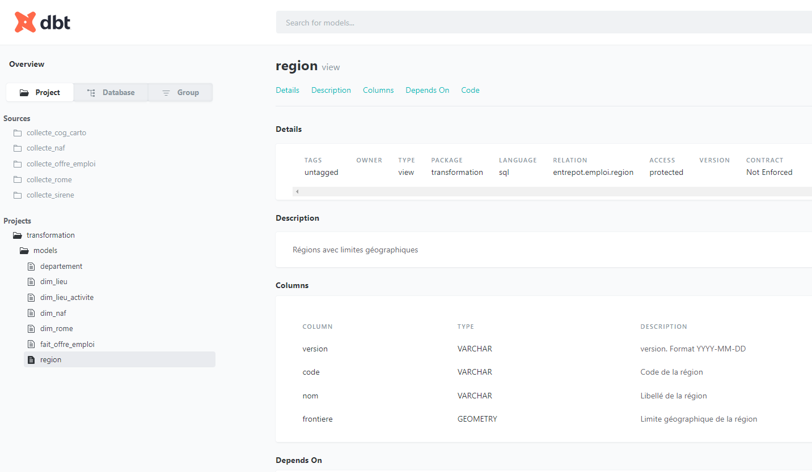
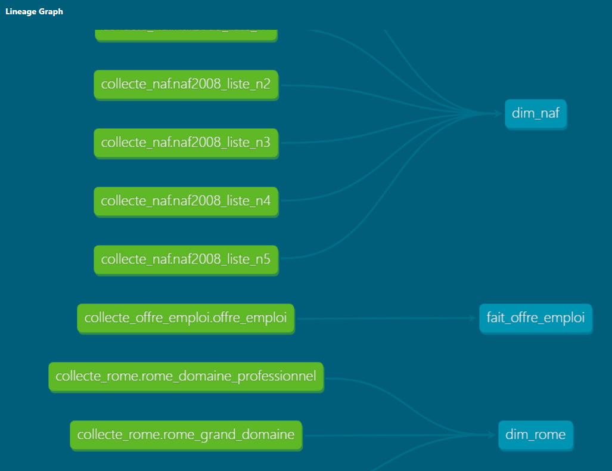

# Transformation des données brutes avec DBT

- Installation dbt-duckdb

```powershell
python -m pip install dbt-duckdb

dbt --version                   
Core:
  - installed: 1.8.2   
  - latest:    1.8.2 - Up to date!

Plugins:
  - duckdb: 1.8.1 - Up to date!   
```

- Création du projet DBT "transformation"

```powershell
dbt init transformation
10:06:31  Running with dbt=1.8.2
10:06:31
Your new dbt project "transformation" was created!

For more information on how to configure the profiles.yml file,
please consult the dbt documentation here:

  https://docs.getdbt.com/docs/configure-your-profile

One more thing:

Need help? Don't hesitate to reach out to us via GitHub issues or on Slack:

  https://community.getdbt.com/

Happy modeling!

10:06:31  Setting up your profile.
Which database would you like to use?
[1] duckdb

(Don't see the one you want? https://docs.getdbt.com/docs/available-adapters)

Enter a number: 1 
```

- Ajouter un fichier **profiles.yml** à la racine du dossier transformation

```yaml
transformation:
  target: dev
  outputs:
    dev:
      type: duckdb
      path: ..\stockage\entrepot.duckdb
      schema: entrepot
    prod:
      type: duckdb
      path: ..\stockage\entrepot.duckdb
      schema: entrepot
```

- Tester la connexion avec la commande dbt debug qui doit se terminer par le message *All checks passed!*

```powershell

cd .\transformation\

# Tester la configuration; Doit se terminer par le message "All checks passed!"
dbt debug

07:48:42  Running with dbt=1.8.2
07:48:42  dbt version: 1.8.2
07:48:42  python version: 3.10.11
07:48:42  python path: C:\privé\DE\data-analyse-francetravail\.venv\Scripts\python.exe
07:48:42  os info: Windows-10-10.0.19044-SP0
07:48:43  Using profiles dir at C:\privé\DE\data-analyse-francetravail\transformation
07:48:43  Using profiles.yml file at C:\privé\DE\data-analyse-francetravail\transformation\profiles.yml
07:48:43  Using dbt_project.yml file at C:\privé\DE\data-analyse-francetravail\transformation\dbt_project.yml
07:48:43  adapter type: duckdb
07:48:43  adapter version: 1.8.1
07:48:43  Configuration:
07:48:43    profiles.yml file [OK found and valid]
07:48:43    dbt_project.yml file [OK found and valid]
07:48:43  Required dependencies:
07:48:43   - git [OK found]

07:48:43  Connection:
07:48:43    database: entrepot
07:48:43    schema: entrepot
07:48:43    path: ..\stockage\entrepot.duckdb
07:48:43    config_options: None
07:48:43    extensions: None
07:48:43    settings: None
07:48:43    external_root: .
07:48:43    use_credential_provider: None
07:48:43    attach: None
07:48:43    filesystems: None
07:48:43    remote: None
07:48:43    plugins: None
07:48:43    disable_transactions: False
07:48:43  Registered adapter: duckdb=1.8.1
07:48:43    Connection test: [OK connection ok]

07:48:43  All checks passed!

# Générer la documentation DBT
dbt docs generate

# Executer le site web local de documentation
dbt docs serve

# Execution des models DBT, construction de l'entrepôt
dbt run

```

## Documentation




